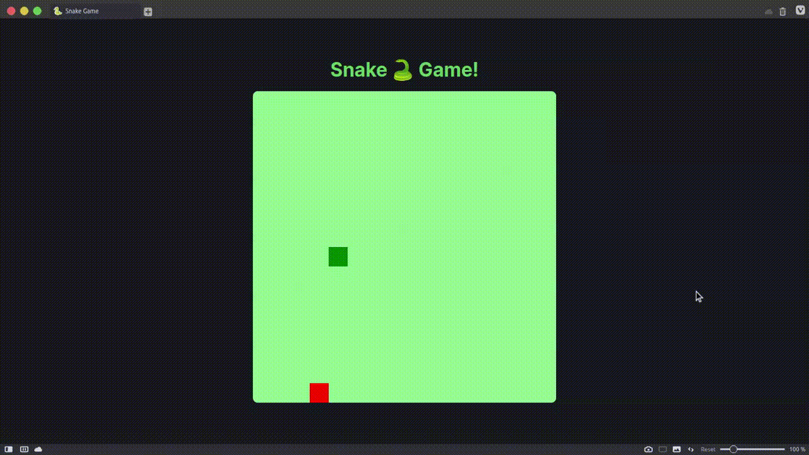

## 🐍 Snake game 👾



### 🚀 Technologies and tools used:

- [x] React.Js
- [x] Next.js
- [x] Typescript
- [x] Styled-components
- [x] Eslint
- [x] Lottie

## 🗂 Project structure

```
.
├── public
│   └── favicon.svg
├── src
│   ├── animation
│   │   ├── 404-error.json
│   │   └── 500-error.json
│   ├── pages
│   │   ├── 404.tsx
│   │   ├── 500.tsx
│   │   ├── _app.tsx
│   │   ├── _document.tsx
│   │   └── index.tsx
│   ├── styles
│   │   ├── pages
│   │   │   ├── error
│   │   │   │   └── styles.ts
│   │   │   └── index
│   │   │       └── styles.ts
│   │   ├── themes
│   │   │   ├── dracula.ts
│   │   │   └── light.ts
│   │   └── global.ts
│   └── @types
│       ├── env.config.d.ts
│       ├── index.d.ts
│       └── styled.d.ts
├── next.config.js
├── next-env.d.ts
├── package.json
├── README.md
├── tsconfig.json
└── yarn.lock
```

## 🏃‍♂️ Running project locally
> 💡 Before running the project locally, you need to have [yarn](#debian-stable) (package manager) installed on your machine

1. Run command to clone repository+
    ~~~bash
    git clone -b snake-game git@github.com:AntonioNarcilio/dio.git snake-game
    ~~~

2. Access the created directory and run the command to install the project's dependencies.
    ~~~bash
    cd snake-game && yarn setup
    ~~~
3. Finally run the application
    ~~~bash
    yarn dev
    ~~~

---

Created by ❤️ Antonio Narcilio
